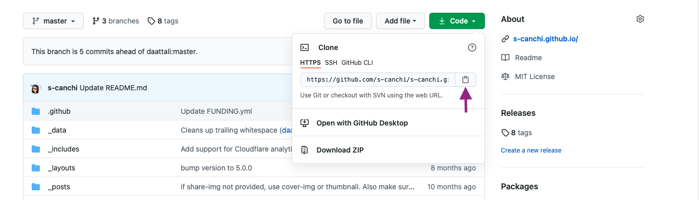

This post will walk you through all the steps needed to setup your own website using Jekyll and Github pages documenting set up a local version of the blog repository (repo) in a virtual environment using [conda](https://docs.conda.io/en/latest/){:target="_blank"}.

{: .box-note}
**Note:** All the instructions are written and tested on macOS Big Sur (v11.2.3).

Let's get started with some concepts. [Github](https://github.com){:target="_blank"} is a hosting platform that enables version control and collaboration. You can read about the different features of Github in [this tutorial](https://angus.readthedocs.io/en/2019/github.html){:target="_blank"}. You need to have a Github account (which is free!) to have access to [Github pages](https://pages.github.com){:target="_blank"}, which is their static site hosting service.

The main distinction of a static site, is that it contains pre-built HTML files that get collectively displayed as a website when compared to dynamic sites, which build the websites "on the fly" to display to the user.

A static site generator allows you to choose a template theme for your content and generate the required HTML pages from [Markdown](https://www.markdowntutorial.com){:target="_blank"}, which is an easy to write and read format for web content. [Jekyll](https://jekyllrb.com){:target="_blank"} is one such static site generator which this blog site is based upon and uses the [beautiful-jekyll theme](https://beautifuljekyll.com){:target="_blank"}.   


## Step 1: Fork the Project and rename the repository

Follow the steps 1 & 2 from the [beautiful-jekyll README](https://github.com/daattali/beautiful-jekyll#readme) to fork the project to your own account and renaming the repo with `<yourusername>.github.io`. This will be the web address where your blog site will render.

For simplicity, you can do step 3 of setup on the Github interface and your site will automatically render. This is because, the theme comes with a [Github Action](https://github.com/features/actions){:target="_blank"} file in the `.github` folder named `ci.yml` which automatically uploads any new changes to the website. However, it is easier to set up a local version of the repo to enable you to work on your files and push it to Github instead on relying on Github interface to create and edit.

## Step 2: Create a copy of the repo on your local machine

{: .box-note}
**Note:** This step requires you to have git setup on your computer and connected to your Github account. Check out [installation instructions for git on macOS](https://github.com/git-guides/install-git){:target="_blank"}.

In the newly forked repo, use the git clone option listed under the `Code` tab to copy the repo URL. Back on the terminal, enter the following code to create a local version of the repo.



Back on the terminal, enter the following code:

```bash
git clone <repo-URL>
```

You now have local version of the repo on your machine!

## Step 3: Setup jekyll in a virtual environment

Conda is software and package manager. To get started, you can install [Miniconda](https://docs.conda.io/en/latest/miniconda.html){:target="_blank"}, a lightweight version of the installer. After successful installation of conda, you will notice your command prompt is prepended with `(base)` to reflect an activate conda base environment.

```bash
(base) $
```

First, create an empty environment using conda. This helps keep all the software along with versions isolated from your main system.

```bash
(base) $ conda create --name mysite python
```
Activate the environment. This will update the text before the prompt to reflect the new virtual environment.

```bash
(base) $ conda activate mysite
(mysite) $
```

{: .box-note}
**Note:** Check out the [conda cheat sheet](https://docs.conda.io/projects/conda/en/4.6.0/_downloads/52a95608c49671267e40c689e0bc00ca/conda-cheatsheet.pdf){:target="_blank"} for quick access to commonly used command.

Next, install the required compilers and dependencies.

```bash
(mysite) $ conda install -c conda-forge c-compiler compilers cxx-compiler
(mysite) $ conda install -c conda-forge ruby
```
Finally, you can install jekyll.

```bash
(mysite) $ gem install jekyll bundler
```

A downloadable and installable package in Ruby is called `gem` and `bundler` is a dependency management tool for Ruby.

You can check the version of jekyll as a way to gauge success of the installation.

```bash
(mysite) $ bundle exec jekyll -v
```

## Step 4: Create gh-pages branch

The default branch for the repo will be called `master`. However, we can choose to publish our site from the `gh-pages` branch.

```bash
(mysite) $ git checkout --orphan gh-pages
```

This will create a new branch called `gh-pages` with no previous history or content and switch to it.

## Step 5: Adjust setup file for local render

Jekyll template comes populated with generic content in form of markdown files i.e. `.md` extension. The `_posts` folder hosts all the content for the website and contains some sample markdown files.

First, we need to update the `Gemfile` to define the specifications. The Gemfile is a Ruby file which stores all the dependencies for the Jekyll site. You need to add the `gh-pages` gem since we want to deploy our site as well as `jekyll-paginate` since the beautiful-jekyll depends on it. Check the [Github Pages dependency page](https://pages.github.com/versions/){:target="_blank"} to obtain the latest version.

Add these lines to the Gemfile, save and close:

```Text
gem 'github-pages', '~> <version# from dependency page>'
gem 'jekyll-paginate'
```

Update the settings by running this code at the command line:

```bash
(mysite) $ bundle update
```
The `_config.yml` file is in yaml format and stores attributes about the site as key value pairs. The default file comes with commented code for each of the parameters which you can change accordingly. You can now build the site locally and render it to view the contents:

```bash
(mysite) $ bundle exec jekyll serve
```
On macOS the output looks like this (with your username):

```bash
Configuration file: /Users/<username>/Desktop/GitHub/<username>.github.io/_config.yml
            Source: /Users/<username>/Desktop/GitHub/<username>.github.io
       Destination: /Users/<username>/Desktop/GitHub/<username>.github.io/_site
 Incremental build: disabled. Enable with --incremental
      Generating...
                    done in 0.418 seconds.
 Auto-regeneration: enabled for '/Users/<username>/Desktop/GitHub/<username>.github.io'
    Server address: http://127.0.0.1:4000
  Server running... press ctrl-c to stop.
```

Open a web browser and copy the http address in the Server address field to render the website. You now have a working render of the website!

## Step 6: Upload local changes to the GitHub

So far, you have made changes to the setup file and perhaps added additional content and are happy with the local render. To publish these changes for the world to see, we need to upload or in git terms "push" these changes to GitHub.

First, we can check all the files that have changed since we downloaded the repo (in this case Gemfile).

```bash
(mysite) $ git status
```
Next, we can add the changes to be preserved.

```bash
(mysite) $ git add <path to files>
```

We are now ready to commit these changes i.e take a snapshot of the repository in its current form to be able to upload to the remote server i.e. your GitHub repo. Typically, we want to use the `-m` or message flag with this command and add a suitable message to indicate what changes are being made. This is helpful for you or your collaborators to go back in time and view the edits. Think of it like track changes in microsoft word but on a much fine grained resolution. Here, the command shows an example commit message.


```bash
(mysite) $ git commit -m "Jekyll site setup with Gemfile and setting up gh-pages"
```

Finally, you can now upload or "push" these changes to reflect in your GitHub repo.

```bash
(mysite) $ git push
```

Since, the GitHub actions is already setup, this push will trigger the build and deployment of your site. It should now render at `<yourusername>.github.io`

Now you are all setup. Posting to your site is now only a push away!
